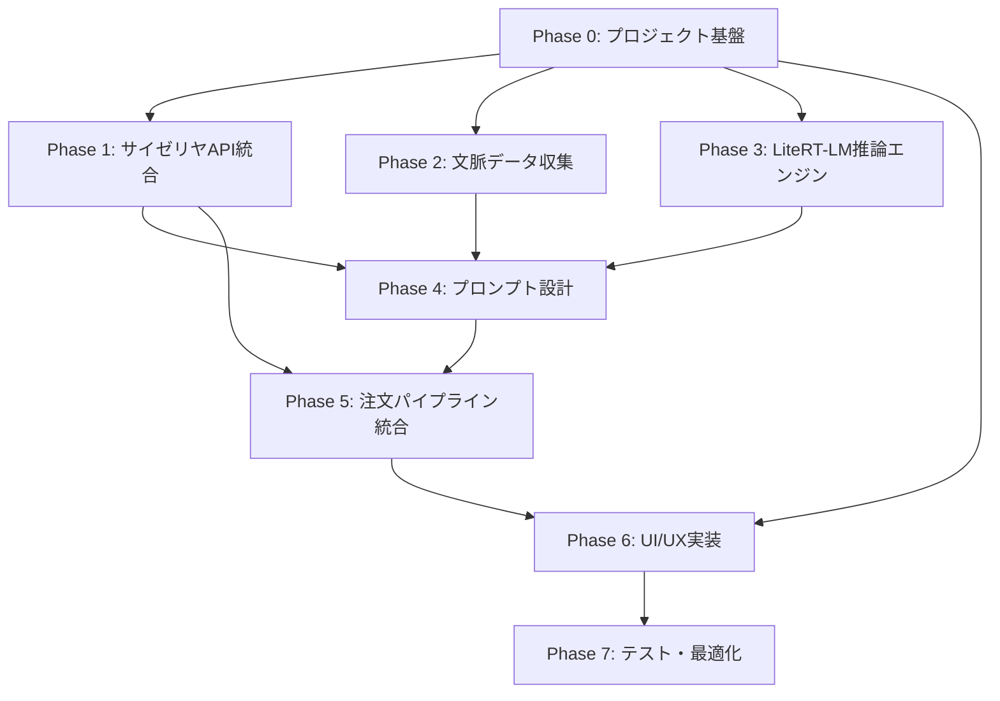

# 実装計画 — Galaxy S24 サイゼリヤ自動注文システム

## 概要

本ドキュメントは、Galaxy S24 上で完全にローカル動作する文脈駆動型サイゼリヤ自動注文システムの**フェーズ別実装計画**を定義する。
各フェーズは独立したMarkdownファイルとして管理され、下位モデルでも実装可能なレベルの詳細さで記述されている。

## フェーズ一覧

| フェーズ | ファイル | 内容 | 想定期間 |
|----------|----------|------|----------|
| Phase 0 | [phase0_project_foundation.md](./phase0_project_foundation.md) | プロジェクト基盤構築 | 2日 |
| Phase 1 | [phase1_saizeriya_client.md](./phase1_saizeriya_client.md) | サイゼリヤAPI統合（メニュー取得・注文実行） | 3日 |
| Phase 2 | [phase2_context_collection.md](./phase2_context_collection.md) | 文脈データ収集（Health Connect / Weather / Gmail） | 4日 |
| Phase 3 | [phase3_litert_lm_engine.md](./phase3_litert_lm_engine.md) | LiteRT-LM推論エンジン統合 | 3日 |
| Phase 4 | [phase4_prompt_design.md](./phase4_prompt_design.md) | プロンプト設計・メニュー選定ロジック | 2日 |
| Phase 5 | [phase5_order_pipeline.md](./phase5_order_pipeline.md) | 注文実行パイプライン統合 | 2日 |
| Phase 6 | [phase6_ui_ux.md](./phase6_ui_ux.md) | UI/UX実装（Jetpack Compose） | 4日 |
| Phase 7 | [phase7_testing_optimization.md](./phase7_testing_optimization.md) | テスト・最適化・リリース準備 | 3日 |

## フェーズ依存関係



## 技術スタック（確定版）

| レイヤー | 技術 | バージョン |
|----------|------|-----------|
| Android App | Kotlin + Jetpack Compose | Kotlin 2.0+, Compose BOM 2024+ |
| ビルドシステム | Gradle (Kotlin DSL) | 8.x |
| HTTP通信 | Ktor Client | 3.x |
| JSON処理 | Kotlinx Serialization | 1.7+ |
| 非同期処理 | Kotlin Coroutines | 1.9+ |
| 推論エンジン | LiteRT-LM | 最新 |
| LLMモデル | Gemma 4-E4B / Gemma 4-E2B | `.litertlm` 形式 |
| 健康データ | Health Connect SDK | 最新 |
| 天候データ | OpenWeatherMap API | 3.0 |
| メール | Gmail API (Android) | 最新 |

## プロジェクト構成（最終形）

```
app/
├── build.gradle.kts
├── src/
│   ├── main/
│   │   ├── kotlin/com/example/saizeriya/
│   │   │   ├── SaizeriyaApp.kt              # Applicationクラス
│   │   │   ├── MainActivity.kt              # エントリーポイント
│   │   │   ├── data/
│   │   │   │   ├── model/
│   │   │   │   │   ├── MenuItem.kt           # メニューデータモデル
│   │   │   │   │   ├── ContextData.kt        # 文脈データモデル
│   │   │   │   │   ├── OrderRequest.kt       # 注文リクエストモデル
│   │   │   │   │   └── LlmResponse.kt        # LLM応答モデル
│   │   │   │   └── repository/
│   │   │   │       ├── MenuRepository.kt      # メニューデータ取得
│   │   │   │       └── OrderRepository.kt     # 注文実行
│   │   │   ├── context/
│   │   │   │   ├── ContextCollector.kt        # 文脈データ統合
│   │   │   │   ├── HealthDataProvider.kt      # Health Connect
│   │   │   │   ├── WeatherProvider.kt         # Weather API
│   │   │   │   └── GmailProvider.kt           # Gmail API
│   │   │   ├── llm/
│   │   │   │   ├── LlmEngine.kt              # LiteRT-LM管理
│   │   │   │   ├── PromptBuilder.kt           # プロンプト生成
│   │   │   │   └── ResponseParser.kt          # LLM出力パース
│   │   │   ├── order/
│   │   │   │   ├── SaizeriyaClient.kt         # サイゼリヤHTTPクライアント
│   │   │   │   ├── OrderExecutor.kt           # 注文実行制御
│   │   │   │   └── OrderPipeline.kt           # E2Eパイプライン
│   │   │   └── ui/
│   │   │       ├── theme/
│   │   │       │   └── Theme.kt
│   │   │       ├── screen/
│   │   │       │   ├── HomeScreen.kt
│   │   │       │   ├── OrderScreen.kt
│   │   │       │   └── ResultScreen.kt
│   │   │       └── viewmodel/
│   │   │           └── OrderViewModel.kt
│   │   ├── res/
│   │   └── AndroidManifest.xml
│   └── test/
│       └── kotlin/com/example/saizeriya/
│           ├── order/SaizeriyaClientTest.kt
│           ├── llm/PromptBuilderTest.kt
│           └── context/ContextCollectorTest.kt
```

## 全フェーズ共通ルール

1. **コメント・コミットメッセージ**: 日本語で記述する
2. **コーディング規約**: Kotlin公式規約に準拠
3. **非同期処理**: `Dispatchers.IO` + Coroutinesを使用
4. **リソース管理**: `Engine.close()` 等のリソース解放を必ず実施
5. **テスト**: 各フェーズの完了条件にユニットテスト通過を含む
6. **ドキュメント**: アーキテクチャ変更時は `README.md` を同期更新する
